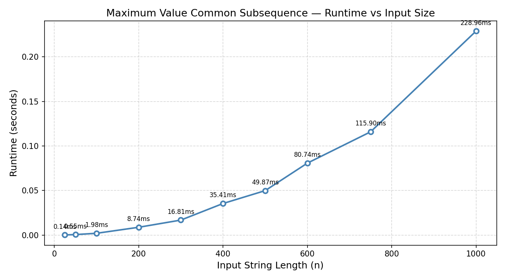

# Programming Assignment 3

## Student Information
Name: Howard Miller
UFID: 58273949

## Project Structure

```
PA3/
├── src/
│   └── PA_3.py                  # Dynamic programming implementation
├── tests/
│   ├── test.py                  # Test script with example inputs
│   └── example.in / example.out # Provided sample input and output
├── inputs/
│   ├── generate_inputs.py       # Script to regenerate input files
│   ├── input_25.in              # Input: strings of length 25
│   ├── input_50.in              # Input: strings of length 50
│   ├── input_100.in             # Input: strings of length 100
│   ├── input_200.in             # Input: strings of length 200
│   ├── input_300.in             # Input: strings of length 300
│   ├── input_400.in             # Input: strings of length 400
│   ├── input_500.in             # Input: strings of length 500
│   ├── input_600.in             # Input: strings of length 600
│   ├── input_750.in             # Input: strings of length 750
│   └── input_1000.in            # Input: strings of length 1000
├── benchmark.py                 # Times all input files and generates graph
└── runtime_graph.png            # Output graph of runtime vs input size
```


## Dependencies

- Python 3.x
- matplotlib (for graphing)

Install matplotlib with:

```bash
pip3 install matplotlib
```

## Build / Compilation

No compilation required. This project uses pure Python 3.

## How to Run

### Run the benchmark (times all 10 input files and saves graph)

```bash
python3 benchmark.py
```

This prints a runtime table and saves `runtime_graph.png` in the project root.

Example output:
```
File                        Length     Time (s)
------------------------------------------------
input_25.in                     25     0.000136
input_50.in                     50     0.000548
input_100.in                   100     0.001981
input_200.in                   200     0.008741
input_300.in                   300     0.016814
input_400.in                   400     0.035414
input_500.in                   500     0.049869
input_600.in                   600     0.080740
input_750.in                   750     0.115895
input_1000.in                 1000     0.228955
```

### Run the main algorithm directly

From the project root directory:

```bash
python3 src/PA_3.py
```

Expected output:
```
9
CB
```

### Run the test script

From the project root directory:

```bash
python3 tests/test.py
```

Expected output:
```
9
CB
```

## Algorithm Description

The program solves the **Maximum Value Common Subsequence** problem using dynamic programming.

- `FindMaxVal(A, B, v)` — builds an OPT table of size `(m+1) x (n+1)` where `OPT[i][j]` is the maximum value achievable from a common subsequence of `A[0..i-1]` and `B[0..j-1]`. Returns the maximum value and the full OPT table.
- `FindSubsequence(OPT, A, B, v)` — backtracks through the OPT table to reconstruct the actual subsequence.

## Example

Given:
- `A = "AACB"`
- `B = "CAAB"`
- `v = {'A': 2, 'B': 4, 'C': 5}`

Output:
- Maximum value: `9`
- Subsequence: `CB`

## Assumptions

- Input strings `A` and `B` contain only characters present as keys in the value dictionary `v`.
- The value dictionary `v` maps each character to a positive integer score.
- The subsequence returned is one valid optimal subsequence (there may be multiple with the same value).
- Both `src/` and `tests/` must be run from the project root directory so that Python can resolve the `src` package path.

# Question 1: Empirical Comparison


# Question 2: Recurrence Equation
OPT(i, j) = a common subsequence of A and B that maximizes the total value

Case 1: Take both i and j if A[i] == B[j]
- v(A[i]) + OPT(i-1, j-1)
Case 2: Take only i
- OPT(i-1, j)
Case 3: Take only j
- OPT(i, j-1)

Recurrence Equation: 
OPT(i, j) = 
    {
        0                               if i=0 or j=0
        max {                           if A[i] == B[i]
            v(A[i]) + OPT(i-1, j-1)     
            OPT(i-1, j)        
            OPT(i, j-1)         
        }

    }

# Question 3: Big-Oh
PSEDUOCODE
FUNCTION def FindMaxVal(A, B, v):
    m = length of A
    n = length of B
    
    // Initialize an (m+1) x (n+1) table with 0s
    // Row 0 and Col 0 naturally represent our base cases (empty prefixes)
    CREATE table OPT[0..m][0..n] initialized to 0

    // Fill the table systematically
    FOR i = 1 to m:
        FOR j = 1 to n:
            
            // Calculate the values of our three possible choices
            val_skip_A = OPT[i-1][j]
            val_skip_B = OPT[i][j-1]
            
            IF A[i] == B[j]:
                val_take_match = OPT[i-1][j-1] + v(A[i])
                // The "Brute-Force" step: strictly evaluate all 3 options
                OPT[i][j] = max(val_take_match, val_skip_A, val_skip_B)
            ELSE:
                // Mismatch: we must skip one or the other
                OPT[i][j] = max(val_skip_A, val_skip_B)

    // The maximum possible value is in the bottom-right corner
    RETURN OPT

FUNCTION FindSubsequence(OPT, A, B, v)
    i = length of A
    j = length of B
    sequence = empty string/array
    
    WHILE i > 0 AND j > 0:
        
        // If they match, check if taking the match was actually the optimal choice
        IF A[i] == B[j] AND OPT[i][j] == OPT[i-1][j-1] + v(A[i]):
            // The match was optimal! Add to sequence.
            PREPEND A[i] to sequence
            i = i - 1
            j = j - 1
            
        // Otherwise, see which skip path gave us the current value
        ELSE IF OPT[i][j] == OPT[i-1][j]:
            // We got this value by skipping A[i]
            i = i - 1
            
        ELSE:
            // We got this value by skipping B[j]
            j = j - 1
            
    RETURN sequence

RUNTIME
O(n * m)